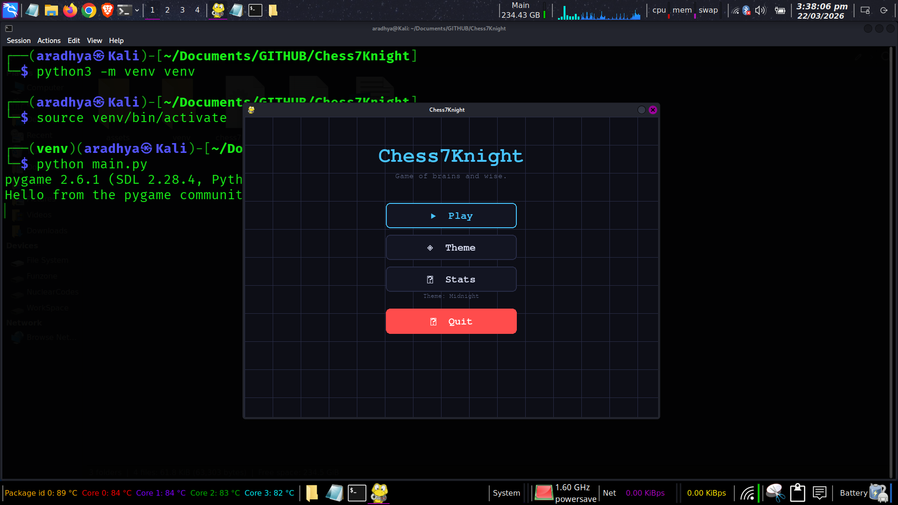
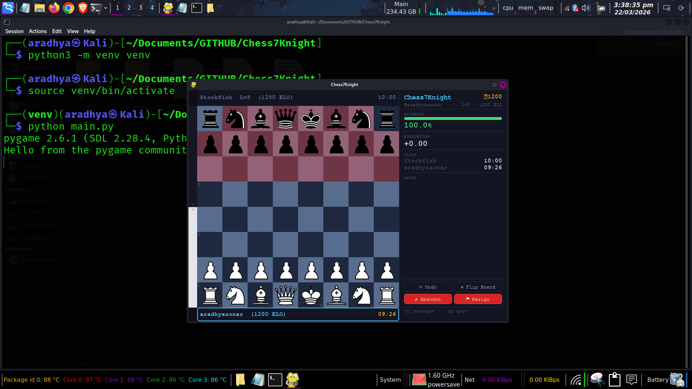
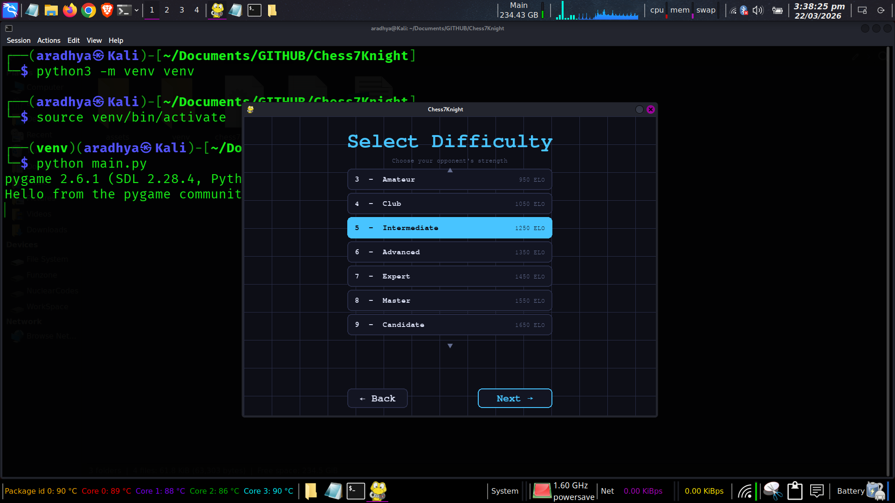

# ♞ Chess7Knight

> A local chess game built with Python, Pygame, and Stockfish.

Chess7Knight is a fully featured desktop chess application with a polished UI, 11 ELO-rated difficulty levels, live evaluation bar, move accuracy scoring, dynamic player rating, persistent match statistics, and multiple visual themes — all running locally with no internet required.

---

## 📸 Features

| Feature | Details |
|---|---|
| **11 Difficulty Levels** | ELO 400 (Beginner) → ELO 1950 (Grandmaster), each with calibrated Stockfish skill and time |
| **Play as White or Black** | Full board flip support; manual flip toggle mid-game |
| **Live Evaluation Bar** | Vertical centipawn bar updates after every move |
| **Move Accuracy** | Centipawn-loss formula scores each of your moves 0–100% |
| **Dynamic ELO Rating** | Your rating rises and falls based on per-move accuracy |
| **Tutor Mode** | Legal move dots shown on click (toggleable) |
| **Danger Squares** | Highlights squares attacked by opponent (toggleable) |
| **In-Game Actions** | Undo, Flip Board, Abandon Match, Resign |
| **4 Visual Themes** | Midnight · Forest · Ivory · Neon (cycle with `T`) |
| **Persistent Stats** | Win/loss/draw history saved to JSON, viewable in-app |
| **Clean Menu Flow** | Main → Play → Difficulty → Side → Options → Game |

---

## 🗂 Project Structure

```
Chess7Knight/
├── main.py                      # Main game file
├── chess7knight_stats.json      # Auto-created on first match
├── README.md
└── assets/
    └── pieces/                  # Chess piece images (PNG)
        ├── wp.png  wr.png  wn.png  wb.png  wq.png  wk.png
        └── bp.png  br.png  bn.png  bb.png  bq.png  bk.png
```

> **Note:** If piece images are missing the game will fall back to coloured circle placeholders so it still runs.

---

## 🖥 Requirements

- Python **3.9+**
- [Pygame](https://www.pygame.org/) `2.x`
- [python-chess](https://python-chess.readthedocs.io/)
- [Stockfish](https://stockfishchess.org/) chess engine (binary)

---

## ⚙️ Installation

### 1 — Clone the repository

```bash
git clone https://github.com/aradhyasonar/Chess7Knight.git
cd Chess7Knight
```

### 2 — Create and activate a virtual environment *(recommended)*

```bash
python3 -m venv venv
source venv/bin/activate          # macOS / Linux
venv\Scripts\activate             # Windows
```

### 3 — Install Python dependencies

```bash
pip install pygame python-chess
```

### 4 — Install Stockfish

**Ubuntu / Debian**
```bash
sudo apt update && sudo apt install stockfish
```

**macOS (Homebrew)**
```bash
brew install stockfish
```

**Windows**
1. Download the binary from [stockfishchess.org/download](https://stockfishchess.org/download/)
2. Place `stockfish.exe` somewhere on your `PATH`, or update the path in `main.py`:

```python
# main.py  ~line 60
engine = chess.engine.SimpleEngine.popen_uci("/usr/games/stockfish")
#                                             ^^^^^^^^^^^^^^^^^^^^^^^^^^^
#  Change this to your actual Stockfish path, e.g.:
#  Windows:  "C:/Users/you/stockfish/stockfish-windows.exe"
#  macOS:    "/usr/local/bin/stockfish"
```

### 5 — Add piece images
Place 12 PNG images sized at least **70×70 px** inside `assets/pieces/`:

```
wp.png  wr.png  wn.png  wb.png  wq.png  wk.png   ← white pieces
bp.png  br.png  bn.png  bb.png  bq.png  bk.png   ← black pieces
```
---

## ▶️ Running the Game

```bash
python main.py
```

---

## 🎮 Controls

### Menus

| Key / Action | Effect |
|---|---|
| `Mouse click` | Navigate buttons |
| `↑ / ↓` | Scroll difficulty list |
| `Scroll wheel` | Scroll difficulty / stats list |
| `T` | Cycle themes |
| `Q` / `Esc` | Quit |

### In-Game — Keyboard

| Key | Action |
|---|---|
| `U` | Undo last 2 plies (your move + AI response) |
| `T` | Cycle visual theme |
| `M` | Return to main menu |
| `R` | Start a new game (after game over) |
| `Q` / `Esc` | Quit |

### In-Game — Panel Buttons

| Button | Action |
|---|---|
| `⟲ Undo` | Take back last 2 moves |
| `⇅ Flip Board` | Rotate the board view |
| `✗ Abandon` | Abandon match (confirm dialog) → back to menu |
| `⚑ Resign` | Resign match (confirm dialog) → game over screen |

### Board

| Action | Effect |
|---|---|
| Click a piece | Select it (legal move dots appear if Tutor Mode is on) |
| Drag and drop | Move a piece |

---

## 🏆 Difficulty Levels

| Level | Name | ELO | Stockfish Time |
|---|---|---|---|
| 1 | Beginner | 400 | 0.05 s |
| 2 | Casual | 750 | 0.10 s |
| 3 | Amateur | 950 | 0.15 s |
| 4 | Club | 1050 | 0.20 s |
| 5 | Intermediate | 1250 | 0.30 s |
| 6 | Advanced | 1350 | 0.40 s |
| 7 | Expert | 1450 | 0.50 s |
| 8 | Master | 1550 | 0.70 s |
| 9 | Candidate | 1650 | 0.90 s |
| 10 | International | 1850 | 1.20 s |
| 11 | Grandmaster | 1950 | 2.00 s |

---

## 🎨 Themes

| Theme | Description |
|---|---|
| **Midnight** | Deep navy blue with cyan accent |
| **Forest** | Earthy green with amber highlight |
| **Ivory** | Light warm wood tones, classic look |
| **Neon** | Dark void with purple / magenta glow |

Cycle themes with `T` at any time — in menus or mid-game.

---

## 📊 Stats

Match results are saved automatically to `chess7knight_stats.json` after every game (including abandons and resignations). The **Stats** screen in the main menu shows:

- Total wins, losses, draws
- Best accuracy ever recorded
- Scrollable table of the last 50 matches (result, accuracy, rating, level, move count)

---

## 🔧 Configuration

All tuneable constants are at the top of `main.py`:

```python
USERNAME  = "aradhyasonar"   # Display name
FPS       = 60               # Frame rate
BOARD_PX  = 560              # Board pixel size (must be divisible by 8)
# Stockfish path
engine = chess.engine.SimpleEngine.popen_uci("/usr/games/stockfish")
```

---

## 🐛 Troubleshooting

**`FileNotFoundError` for Stockfish**
Update the Stockfish path in `main.py` to match where it is installed on your system.

```bash
which stockfish          # Linux / macOS — shows the path
where stockfish          # Windows
```

**Piece images not loading**
The game will continue with circle placeholders. Add PNG files to `assets/pieces/` as described above.

**Pygame not found**
```bash
pip install pygame
```

**python-chess not found**
```bash
pip install python-chess
```

---

Chess has always felt like more than just a game to me — it’s a mix of logic, patience, creativity, and sometimes pure chaos. Chess7Knight started as a simple idea: “Can I build a chess game that feels like the ones I enjoy playing online, but runs completely offline and is fully under my control?”

What began as a small experiment with Python and Pygame slowly evolved into something much bigger. Along the way, I learned a lot — not just about game development, but about structuring large projects, handling performance issues, designing UI flows, and integrating powerful tools like Stockfish in a meaningful way.

I wanted this project to feel complete — not just playable, but enjoyable:

Smooth UI and clean navigation
Real-time feedback like evaluation bars and move accuracy
A sense of progression through dynamic rating
Personal touches like themes and persistent stats

There were definitely challenges (and a lot of debugging 😅), but that’s what made building this so rewarding.

If you're exploring the code, building something similar, or just playing the game — I hope it gives you the same satisfaction I had while creating it.

— Aradhya Sonar


## 📸 Screenshots

### Main Menu


### Gameplay


### Evaluation Bar


---
*📝 Last maintained: April 26, 2026 at 13:19 UTC*
